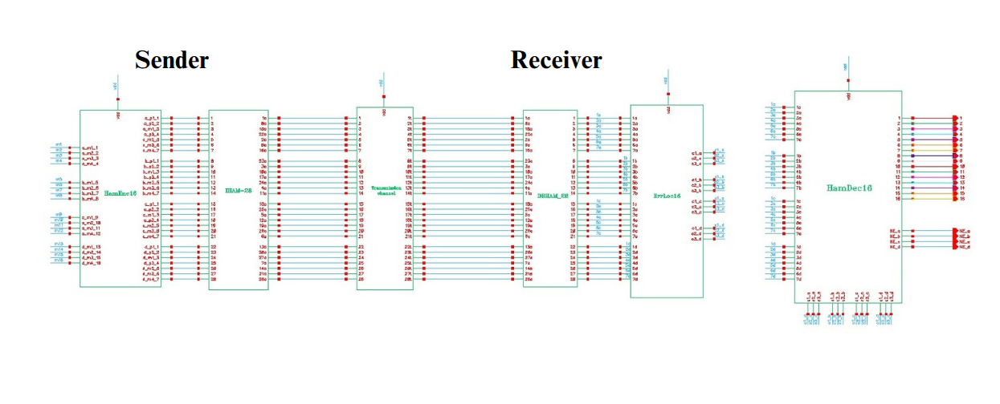
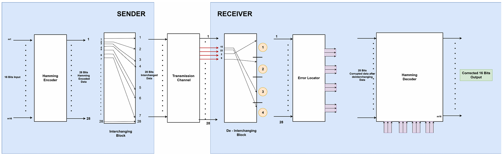
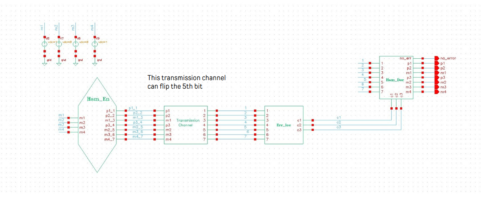
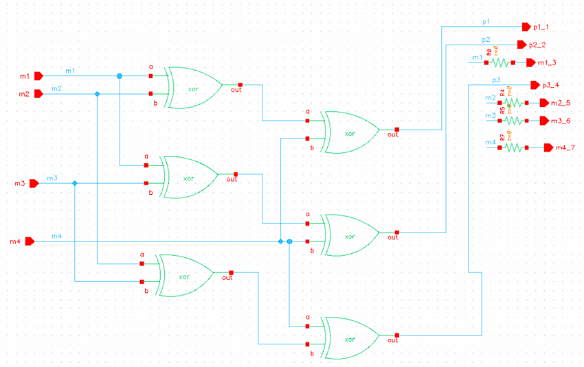
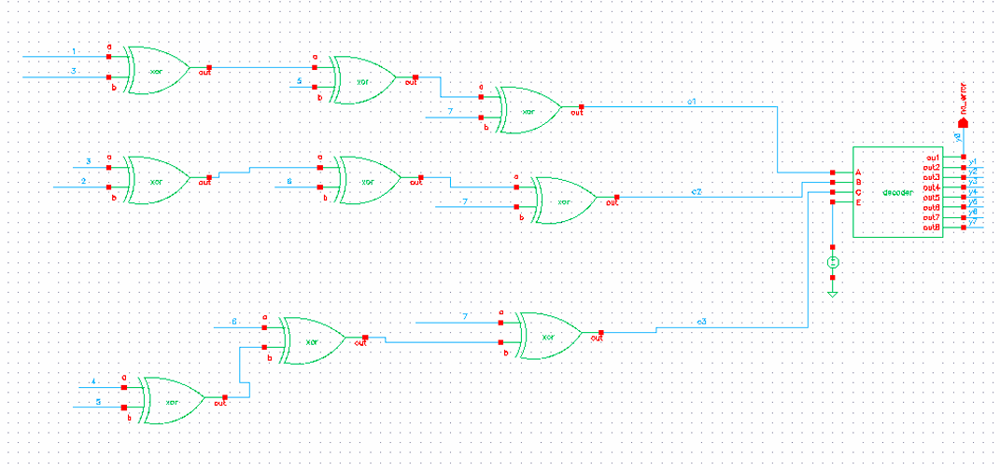
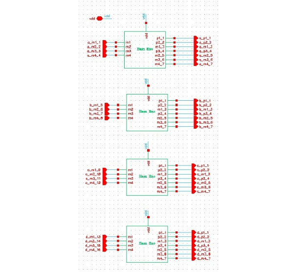

## Overview

This project implements a Burst Error Correction Engine using Hamming Code for a 16-bit data word, capable of correcting up to 4-bit burst errors using interleaving techniques. It implements encoder, syndrome generation, detection, and correction logic to accurately locate and fix errors. The complete system is realized at the transistor (schematic) level in Cadence Virtuoso, ensuring correct operation, low hardware complexity, and reliable performance across fault scenarios.
---

## Hamming Code Specifications

- **Type:** Hamming (7,4)
- **Message Length:** 4 bits
- **Parity Bits:** 3 bits
- **Total Bits:** 7 bits

---

## Why Hamming Codes?

### Comparison with CRC + BCH Approaches

**Increased Latency:**
- BCH decoding is iterative and takes multiple clock cycles, leading to higher delay in real-time applications.
- Hamming (7,4) allows for faster single-step correction.

**No Built-in Correction in CRC:**
- CRC can only detect errors, but it cannot correct them.
- Additional BCH decoding is required, increasing design complexity.

**High Hardware Complexity:**
- BCH decoding requires Galois field arithmetic, which increases circuit complexity and gate count.
- Hamming codes are simpler and require fewer logic gates.

**Power Efficiency:**
- BCH requires complex polynomial division and multiple iterations, leading to higher power consumption.
- Hamming (7,4) with interleaving is a lightweight and power-efficient alternative.

---

## Hamming Code Structure

### Bit Positions and Parity Assignments

**Message bits:** m₁, m₂, m₃, m₄  
**Parity bits:** P₁, P₂, P₃  
**Total codeword:** P₁, P₂, m₁, P₃, m₂, m₃, m₄ (7 bits)

**Parity bit positions:**
- P₁ → positions 1, 3, 5, 7 (C3)
- P₂ → positions 2, 3, 6, 7 (C2)
- P₃ → positions 4, 5, 6, 7 (C1)

### Parity Bit Calculations

Parity bits are calculated using XOR operations:

$$P_1 = m_1 \oplus m_2 \oplus m_4$$
$$P_2 = m_1 \oplus m_3 \oplus m_4$$
$$P_3 = m_2 \oplus m_3 \oplus m_4$$

---

## Encoding Example

**Message bits:** m₁, m₂, m₃, m₄ = 1, 0, 1, 1

### Step 1: Compute Parity Bits

$$P_1 = 1 \oplus 0 \oplus 1 = 0$$
$$P_2 = 1 \oplus 1 \oplus 1 = 1$$
$$P_3 = 0 \oplus 1 \oplus 1 = 0$$

### Step 2: Construct Codeword

**Final (7,4) Hamming codeword:**  
P₁, P₂, m₁, P₃, m₂, m₃, m₄ = **0 1 1 0 0 1 1**

---

## Error Detection & Correction

### How It Works

When the received 7-bit codeword has a single-bit error, the receiver can detect and correct it using **syndrome bits (C)**.

### Step 1: Compute Syndrome Bits

At the receiver, syndrome bits C₁, C₂, C₃ are calculated:

$$C_1 = P_1 \oplus m_1 \oplus m_2 \oplus m_4$$
$$C_2 = P_2 \oplus m_1 \oplus m_3 \oplus m_4$$
$$C_3 = P_3 \oplus m_2 \oplus m_3 \oplus m_4$$

The syndrome value **C = C₁C₂C₃** (binary) gives the position of the error.

### Step 2: Error Correction Logic

- If **C = 000**: No error detected
- If **C ≠ 000**: The binary value of C gives the bit position of the error
  - Flip that bit to correct the error

---

## Error Correction Example

**Received codeword:** 0 1 1 0 **1** 1 1 (instead of 0 1 1 0 0 1 1)

### Computing Syndrome Bits

From the received codeword (0110111):

$$C_1 = 0 \oplus 1 \oplus 1 \oplus 1 = 1$$
$$C_2 = 1 \oplus 1 \oplus 1 \oplus 1 = 0$$
$$C_3 = 0 \oplus 1 \oplus 1 \oplus 1 = 1$$

**Syndrome value:** C = C₁C₂C₃ = **101** (binary) = **5** (decimal)

### Error Localization & Correction

- The syndrome **101** (binary) = **5** (decimal)
- Error is at **bit position 5** (m₂)
- **Received codeword:** 0110111
- **Corrected codeword:** 0110011 (flip bit 5: 1 → 0)
- **Original message bits:** 1011 ✓

---

## Project Architecture

### System Design

The project includes both **encoder** and **decoder** circuits with interleaving support.

### Circuit Diagrams

**Overall Architecture:**

**Hamming (7,4) Encoder Circuit:**

**Hamming Encoder Block Diagram:**

**Hamming Decoder Block Diagram:**

**16-bit Hamming Encoder (with interleaving):**

---

## Implementation Features

- **Interleaving:** Output bits are interchanged for improved error distribution
- **Single-cycle correction:** Fast, single-step error detection and correction
- **Low hardware complexity:** Minimal gate count compared to BCH approaches
- **Power efficient:** Suitable for real-time embedded applications

---

## Timing Verification

Latency is calculated based on the critical path, defined as the longest signal propagation path from input to output, by summing the propagation delays of each logic gate along that path. The delay values are obtained from gate-level timing characteristics (rise delay, fall delay, and propagation delay) of fundamental gates such as NOT, AND, OR, and XOR used in the design. Component-wise delays for the Hamming encoder, transmission channel, error locator, and decoder are evaluated individually, and the overall system latency is computed across the complete data path from sender input to receiver output. For detailed calculations, timing tables, and measurement methodology, please refer to the project report.

## References

- Original project report: [project_report.pdf](project_report.pdf)
- Images directory: [images/](images/)
